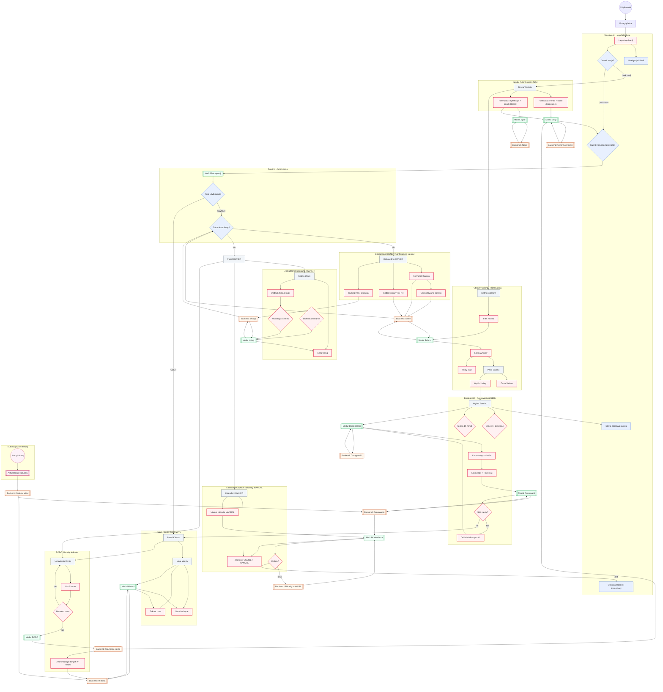

```mermaid
flowchart TD
  %% ========= STYLES =========
  classDef shared fill:#E8F0FE,stroke:#2B5FDB,stroke-width:1px;
  classDef page fill:#F1F5F9,stroke:#334155,stroke-width:1px;
  classDef state fill:#ECFDF5,stroke:#16A34A,stroke-width:1px;
  classDef backend fill:#FFF7ED,stroke:#C2410C,stroke-width:1px;
  classDef job fill:#FDF2F8,stroke:#BE185D,stroke-width:1px;
  classDef updated fill:#FFF1F2,stroke:#E11D48,stroke-width:2px;

  %% ========= ENTRY =========
  U0((Użytkownik)) --> N0[Przeglądarka]
  N0 --> L0["Layout Aplikacji"]:::updated

  %% ========= SHARED UI SHELL =========
  subgraph "Warstwa UI - współdzielona"
    L0
    Nav0["Nawigacja i Shell"]:::shared
    Guard0{"Guard: sesja?"}:::shared
    Guard2{"Guard: rola i kompletność?"}:::shared
    Err0["Obsługa błędów i komunikaty"]:::shared
    TZ0["Strefa czasowa salonu"]:::shared
  end

  L0 --> Nav0
  L0 --> Guard0
  Guard0 --"brak sesji"--> P0["Strona Wejścia"]:::updated
  Guard0 --"jest sesja"--> Guard2

  %% ========= AUTH & CONSENTS =========
  subgraph "Moduł Autentykacji i Zgód"
    P0
    Login0["Formularz: e-mail + hasło (logowanie)"]:::updated
    Register0["Formularz: rejestracja + zgody RODO"]:::updated
  end

  P0 --> Login0
  P0 --> Register0
  Login0 --> S0[[Moduł Sesji]]:::state
  Register0 --> C0[[Moduł Zgód]]:::state
  Register0 --> S0
  C0 --> B1[[Backend: Zgody]]:::backend
  B1 --> C0
  S0 --> B0[[Backend: Uwierzytelnianie]]:::backend
  B0 --> S0
  S0 --> Guard2

  %% ========= ROUTING BY ROLE / COMPLETENESS =========
  subgraph "Routing i Autoryzacja"
    A0[[Moduł Autoryzacji]]:::state
    R0{"Rola użytkownika"}:::shared
    R1{"Salon kompletny?"}:::shared
  end

  Guard2 --> A0
  A0 --> R0
  R0 --"OWNER"--> R1
  R0 --"USER"--> DashU["Panel Klienta"]:::updated
  R1 --"nie"--> Onb0["Onboarding OWNER"]:::updated
  R1 --"tak"--> DashO["Panel OWNER"]:::updated

  %% ========= OWNER ONBOARDING =========
  subgraph "Onboarding OWNER (konfiguracja salonu)"
    Onb0
    SalonForm["Formularz Salonu"]:::updated
    Geo0["Geokodowanie adresu"]:::updated
    HoursForm["Godziny pracy Pn–Nd"]:::updated
    ServicesMin["Wymóg: min. 1 usługa"]:::updated
  end

  Onb0 --> SalonForm
  SalonForm --> Geo0
  Geo0 --> B2[[Backend: Salon]]:::backend
  SalonForm --> B2
  Onb0 --> HoursForm
  HoursForm --> B2
  Onb0 --> ServicesMin
  ServicesMin --> B3[[Backend: Usługi]]:::backend
  B2 --> R1
  B3 --> R1

  %% ========= OWNER SERVICES CRUD =========
  subgraph "Zarządzanie usługami (OWNER)"
    ServP["Strona Usług"]:::updated
    ServList["Lista Usług"]:::updated
    ServForm["Dodaj/Edycja Usługi"]:::updated
    ServRules{"Walidacja 15 minut"}:::updated
    ServDelete{"Blokada usunięcia"}:::updated
  end

  DashO --> ServP
  ServP --> ServList
  ServP --> ServForm
  ServForm --> ServRules
  ServRules --> Usvc0[[Moduł Usług]]:::state
  ServDelete --> Usvc0
  Usvc0 --> B3
  B3 --> Usvc0
  Usvc0 --> ServList

  %% ========= PUBLIC LISTING / DISCOVERY =========
  subgraph "Publiczny Listing i Profil Salonu"
    Pub0["Listing Salonów"]:::updated
    City0["Filtr: miasto"]:::updated
    List0["Lista wyników"]:::updated
    Empty0["Pusty stan"]:::updated
    SalonP["Profil Salonu"]:::updated
    SalonCard["Dane Salonu"]:::updated
    ServicePick["Wybór Usługi"]:::updated
  end

  P0 --> Pub0
  Pub0 --> City0
  City0 --> Sln0[[Moduł Salonu]]:::state
  Sln0 --> B2
  B2 --> Sln0
  Sln0 --> List0
  List0 --> SalonP
  List0 --> Empty0
  SalonP --> SalonCard
  SalonP --> ServicePick

  %% ========= AVAILABILITY & BOOKING (USER) =========
  subgraph "Dostępność i Rezerwacja (USER)"
    SlotsP["Wybór Terminu"]:::updated
    SlotsUI["Lista wolnych slotów"]:::updated
    Window0{"Okno 1h–1 miesiąc"}:::updated
    Grid0{"Siatka 15 minut"}:::updated
    BookBtn["Kliknij slot -> Rezerwuj"]:::updated
    Conflict0{"Slot zajęty?"}:::updated
    Refresh0["Odśwież dostępność"]:::updated
  end

  ServicePick --> SlotsP
  SlotsP --> TZ0
  SlotsP --> Window0
  SlotsP --> Grid0
  SlotsP --> Av0[[Moduł Dostępności]]:::state
  Av0 --> B4[[Backend: Dostępność]]:::backend
  B4 --> Av0
  Av0 --> SlotsUI
  SlotsUI --> BookBtn
  BookBtn --> Res0[[Moduł Rezerwacji]]:::state
  Res0 --> B5[[Backend: Rezerwacje]]:::backend
  B5 --> Res0
  Res0 --> Conflict0
  Conflict0 --"tak"--> Refresh0
  Refresh0 --> Av0
  Conflict0 --"nie"--> DashU

  %% ========= OWNER CALENDAR & MANUAL BLOCKS =========
  subgraph "Kalendarz OWNER i blokady MANUAL"
    CalP["Kalendarz OWNER"]:::updated
    OccList["Zajętości ONLINE + MANUAL"]:::updated
    ManualBtn["Utwórz blokadę MANUAL"]:::updated
    ManualCheck{"Kolizja?"}:::updated
  end

  DashO --> CalP
  CalP --> OccList
  CalP --> ManualBtn
  ManualBtn --> Cal0[[Moduł Kalendarza]]:::state
  Cal0 --> ManualCheck
  ManualCheck --"brak"--> B6[[Backend: Blokady MANUAL]]:::backend
  ManualCheck --"jest"--> Err0
  B6 --> Cal0
  Cal0 --> OccList
  B5 --> Cal0

  %% ========= CLIENT VISITS =========
  subgraph "Panel Klienta: Moje wizyty"
    DashU
    VisitsP["Moje Wizyty"]:::updated
    Upc["Nadchodzące"]:::updated
    Done["Zakończone"]:::updated
  end

  DashU --> VisitsP
  VisitsP --> Upc
  VisitsP --> Done
  VisitsP --> Hist0[[Moduł Historii]]:::state
  Hist0 --> B7[[Backend: Historia]]:::backend
  B7 --> Hist0
  Hist0 --> Upc
  Hist0 --> Done

  %% ========= STATUS UPDATE JOB =========
  subgraph "Automatyczne statusy"
    J0((Job cykliczny)):::job
    J1[[Aktualizacja statusów]]:::job
  end

  J0 --> J1
  J1 --> B8[[Backend: Statusy wizyt]]:::backend
  B8 --> B7
  B8 --> B5

  %% ========= ACCOUNT DELETION (RODO) =========
  subgraph "RODO: Usunięcie konta"
    AccP["Ustawienia Konta"]:::updated
    Del0["Usuń konto"]:::updated
    Confirm0{"Potwierdzenie"}:::updated
    Anon0["Anonimizacja danych w historii"]:::updated
  end

  DashU --> AccP
  DashO --> AccP
  AccP --> Del0
  Del0 --> Confirm0
  Confirm0 --"tak"--> Rodo0[[Moduł RODO]]:::state
  Confirm0 --"nie"--> AccP
  Rodo0 --> B9[[Backend: Usunięcie konta]]:::backend
  B9 --> Anon0
  Anon0 --> B7
  B9 --> S0

  %% ========= CLASS ASSIGNMENTS (for clarity) =========
  class Nav0,Guard0,Guard2,Err0,TZ0 shared;
  class P0,Pub0,SalonP,SlotsP,DashO,DashU,Onb0,ServP,CalP,VisitsP,AccP page;
  class S0,C0,A0,Sln0,Usvc0,Av0,Res0,Cal0,Hist0,Rodo0 state;
  class B0,B1,B2,B3,B4,B5,B6,B7,B8,B9 backend;
  class J0,J1 job;
```
